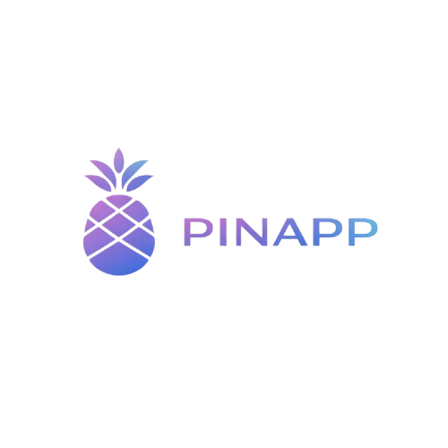

# PATCH — Logo Pinapp + icônes partenaires (complément au patch événementiel)

> À appliquer en même temps que `PATCH-MICHA-EVENEMENTIEL.md`. Corrige le logo en nav + remplace les `` cassées des 7 partenaires footer par des vrais logos/icônes.

---

## 🎨 PROBLÈME ACTUEL

1. **Nav en haut** affiche le texte `Pinapp.` au lieu du vrai logo
2. **Footer partenaires** a 7 `` qui pointent vers des fichiers **inexistants** → icônes broken en prod

## 📁 CE QUI EXISTE DANS LE REPO

Logo Pinapp (déjà présent dans le repo principal) :
- `/assets/images/pinapp-logo.png` (132×36)
- `/assets/images/pinapp-logo-horizontal.png`
- `/assets/images/pinapp-icon.png`

**À copier** dans `voyage-v9/assets/brand/` pour centraliser.

---

## 🛠 PATCH EN 3 POINTS

### 1. Nav en haut — logo à la place du texte

**Action shell** (à faire avant Cursor) :

```powershell
cd C:\Users\Lauralie\Projects\pinapp-site
mkdir voyage-v9\assets\brand -Force
copy assets\images\pinapp-logo.png voyage-v9\assets\brand\pinapp-logo.png
copy assets\images\pinapp-icon.png voyage-v9\assets\brand\pinapp-icon.png
```

**Puis dans Cursor**, remplacer le `<a class="nav__logo">` actuel par :

```html
<a class="nav__logo" href="#s01" aria-label="Pinapp — retour au début">
  
</a>
```

CSS :
```css
.nav__logo{display:inline-flex;align-items:center;text-decoration:none}
.nav__logo-img{height:28px;width:auto;display:block;transition:opacity .25s}
.nav__logo:hover .nav__logo-img{opacity:.85}
@media (max-width:640px){.nav__logo-img{height:24px}}
```

---

### 2. Footer partenaires — 7 SVG inline (vrais logos monochromes)

**Remplacer** le bloc `.partners` actuel (qui référence des fichiers SVG absents) par des SVG **inline** sobres :

```html
<div class="partners">
  <p class="eyebrow partners__label">Stack technique européen</p>
  <div class="partners__grid">

    <a href="https://www.anthropic.com" target="_blank" rel="noopener noreferrer" class="partners__item" aria-label="Anthropic (modèle Claude)">
      <svg viewBox="0 0 24 24" aria-hidden="true" class="partners__ico"><path fill="currentColor" d="M13.93 2 22 22h-4.5l-1.64-4.3H8.14L6.5 22H2L10.07 2zm-.5 5.1-2.67 7h5.34z"/></svg>
      <span>Anthropic</span>
    </a>

    <a href="https://stripe.com" target="_blank" rel="noopener noreferrer" class="partners__item" aria-label="Stripe (paiements)">
      <svg viewBox="0 0 24 24" aria-hidden="true" class="partners__ico"><path fill="currentColor" d="M13.976 9.15c-2.172-.806-3.356-1.426-3.356-2.409 0-.831.683-1.305 1.901-1.305 2.227 0 4.515.858 6.09 1.631V3.149C16.851 2.366 14.56 2 12.521 2 7.63 2 4.374 4.565 4.374 8.855c0 6.688 9.195 5.623 9.195 8.507 0 .98-.852 1.303-2.125 1.303-2.433 0-5.537-1.002-7.296-1.85v4.034c1.941.836 4.41 1.199 7.296 1.199 5.014 0 8.46-2.487 8.46-6.827-.054-7.22-9.274-5.942-9.928-8.071z"/></svg>
      <span>Stripe</span>
    </a>

    <a href="https://n8n.io" target="_blank" rel="noopener noreferrer" class="partners__item" aria-label="n8n (automatisation self-hosted)">
      <svg viewBox="0 0 24 24" aria-hidden="true" class="partners__ico"><circle cx="5" cy="7" r="2.5" fill="currentColor"/><circle cx="12" cy="5" r="2" fill="currentColor"/><circle cx="12" cy="19" r="2" fill="currentColor"/><circle cx="19" cy="12" r="2.5" fill="currentColor"/><path stroke="currentColor" stroke-width="1.5" fill="none" d="M7.5 7h2.5M7.5 7l3 10M14 5h2.5a2.5 2.5 0 0 1 0 5H12M14 19h2.5a2.5 2.5 0 0 0 0-5H12"/></svg>
      <span>n8n</span>
    </a>

    <a href="https://www.hostinger.fr" target="_blank" rel="noopener noreferrer" class="partners__item" aria-label="Hostinger (hébergement européen)">
      <svg viewBox="0 0 24 24" aria-hidden="true" class="partners__ico"><path fill="currentColor" d="M3 4h3v7h6V4h3v16h-3v-7H6v7H3zm16.5 0H22v12.5a3.5 3.5 0 0 1-7 0v-.5h2.5v.5a1 1 0 0 0 2 0z"/></svg>
      <span>Hostinger</span>
    </a>

    <a href="https://fonts.bunny.net" target="_blank" rel="noopener noreferrer" class="partners__item" aria-label="Bunny Fonts (fonts RGPD)">
      <svg viewBox="0 0 24 24" aria-hidden="true" class="partners__ico"><path fill="currentColor" d="M12 2c-2 0-3 1.5-3 4 0 1.2.3 2.2.8 3C7 10 5 13 5 16.5 5 20 7.5 22 12 22s7-2 7-5.5c0-3.5-2-6.5-4.8-7.5.5-.8.8-1.8.8-3 0-2.5-1-4-3-4zm0 14c-1.5 0-2.5-.7-2.5-1.7s1-1.8 2.5-1.8 2.5.8 2.5 1.8S13.5 16 12 16zm-2-4a.8.8 0 1 1 0-1.6.8.8 0 0 1 0 1.6zm4 0a.8.8 0 1 1 0-1.6.8.8 0 0 1 0 1.6z"/></svg>
      <span>Bunny Fonts</span>
    </a>

    <a href="https://plausible.io" target="_blank" rel="noopener noreferrer" class="partners__item" aria-label="Plausible Analytics (RGPD-first)">
      <svg viewBox="0 0 24 24" aria-hidden="true" class="partners__ico"><path fill="currentColor" d="M3 20V4l7 5v11zm8 0V10l7-5v15z" opacity=".9"/></svg>
      <span>Plausible</span>
    </a>

    <a href="https://yousign.com" target="_blank" rel="noopener noreferrer" class="partners__item" aria-label="YouSign (signature électronique européenne)">
      <svg viewBox="0 0 24 24" aria-hidden="true" class="partners__ico"><path fill="currentColor" d="M5 4h14v2H5zm0 4h14v2H5zm0 4h9v2H5zm13 2.5-1.5 1.5 3 3L23 11l-1.5-1.5-3.5 3.5z"/></svg>
      <span>YouSign</span>
    </a>

  </div>
</div>
```

CSS (remplace l'ancien .partners) :
```css
.partners{margin:var(--space-5) 0 var(--space-3);text-align:center}
.partners__label{display:inline-block;margin-bottom:var(--space-3);color:var(--ivoire-dim)}

.partners__grid{
  display:flex;flex-wrap:wrap;justify-content:center;align-items:center;
  gap:var(--space-3) var(--space-4);
  max-width:960px;margin:0 auto
}

.partners__item{
  display:inline-flex;align-items:center;gap:.5rem;
  padding:.5rem .9rem;border-radius:100px;
  background:rgba(10,20,32,.4);
  border:1px solid var(--fumee);
  font-family:var(--sans);font-size:.8125rem;letter-spacing:.04em;
  color:var(--ivoire-dim);text-decoration:none;
  transition:color .25s,border-color .25s,background .25s,transform .25s
}
.partners__item:hover{
  color:var(--ivoire);
  border-color:var(--or);
  background:rgba(230,185,115,.06);
  transform:translateY(-2px)
}
.partners__item:focus-visible{outline:2px solid var(--cyan);outline-offset:3px}

.partners__ico{
  width:20px;height:20px;flex-shrink:0;
  color:var(--ivoire-dim);
  transition:color .25s
}
.partners__item:hover .partners__ico{color:var(--or)}

@media (prefers-reduced-motion:reduce){
  .partners__item,.partners__item:hover,.partners__ico{transition:none;transform:none}
}

@media (max-width:640px){
  .partners__grid{gap:var(--space-2) var(--space-3)}
  .partners__item{padding:.4rem .7rem;font-size:.75rem}
  .partners__ico{width:16px;height:16px}
}
```

---

### 3. Favicon + Apple touch icon (bonus si pas encore en place)

Ajouter dans le `<head>`, après les preloads :

```html
<link rel="icon" type="image/png" sizes="32x32" href="assets/brand/pinapp-icon.png">
<link rel="apple-touch-icon" sizes="180x180" href="assets/brand/pinapp-icon.png">
```

Commande shell pour s'assurer que le fichier existe :
```powershell
copy assets\images\pinapp-icon.png voyage-v9\assets\brand\pinapp-icon.png
```

---

## 🎯 PROMPT CURSOR (combiné événementiel + logo + partenaires)

À coller dans Cursor en UN SEUL bloc :

```
Lis voyage-v9/PATCH-MICHA-EVENEMENTIEL.md et voyage-v9/PATCH-LOGO-PARTENAIRES.md. Applique les 2 patchs en séquence :

PATCH 1 — Événementiel Micha :
- Enrichir scène 03 métier DA avec liste événementiel Nouvelle-Aquitaine + 2 CTA
- Insérer scène 05f "Événementiel vidéo" entre 05d Films IA et 05e Formations avec 2 cartes (Séminaire + Anniversaire) contenant chacune un placeholder-asset
- Form scène 14 : ajouter optgroup "Événementiel vidéo" avec 3 options + champs conditionnels date/lieu

PATCH 2 — Logo + partenaires :
- Vérifier que voyage-v9/assets/brand/pinapp-logo.png et pinapp-icon.png existent (sinon laisser un commentaire TODO)
- Remplacer texte "Pinapp." dans la nav par 
- Remplacer bloc .partners du footer : 7 items inline SVG (Anthropic · Stripe · n8n · Hostinger · Bunny Fonts · Plausible · YouSign) avec icônes vectorielles monochromes + liens externes + rel="noopener noreferrer"
- Ajouter <link rel="icon"> et <link rel="apple-touch-icon">

Règles : vanilla JS, Bunny Fonts, photos hero intouchables, rel="noopener noreferrer", prefers-reduced-motion.

Commit : "feat(voyage-v9): événementiel Micha + logo nav + 7 partenaires SVG inline"
```

---

## 📋 FICHIERS À FOURNIR / COPIER

| Asset | Chemin cible | Source | Action |
|---|---|---|---|
| Logo nav | `voyage-v9/assets/brand/pinapp-logo.png` | `assets/images/pinapp-logo.png` | Copie simple |
| Favicon | `voyage-v9/assets/brand/pinapp-icon.png` | `assets/images/pinapp-icon.png` | Copie simple |
| Séminaire still | `voyage-v9/assets/evenement/seminaire-entreprise.webp` | **Micha à fournir** | À produire |
| Anniversaire still | `voyage-v9/assets/evenement/anniversaire.webp` | **Micha à fournir** | À produire |

---

## ⏱ EFFORT

- Copie 2 fichiers logo/icon : **1 min**
- Application Cursor (2 patchs combinés) : **45-60 min**
- Fourniture 2 stills événementiel Micha : **à faire quand il peut**

Commit final estimé : +300 lignes HTML/CSS, nouvelle scène 05f + refonte nav logo + 7 partenaires SVG.

---

*Patch logo + partenaires 2026-04-24. À appliquer avec PATCH-MICHA-EVENEMENTIEL.md.*
