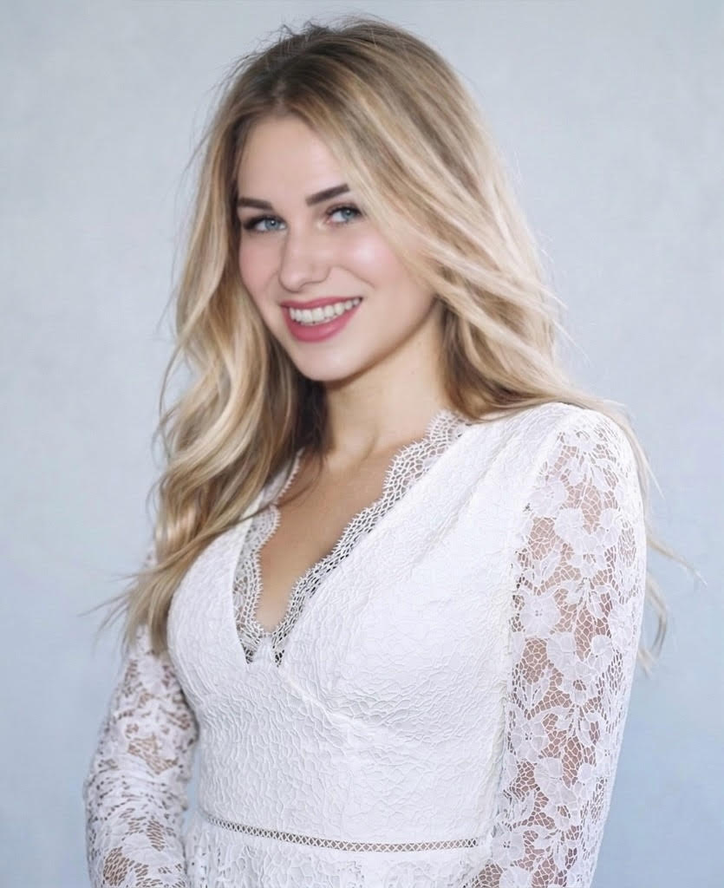
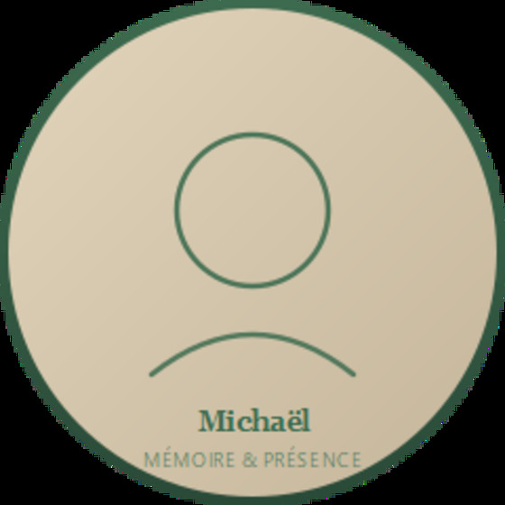

# PATCH "QUI SOMMES-NOUS" — scène 07 voyage-v9

> La scène 07 actuelle utilise des cartes texte avec les lettres "L" et "M".
> Lauralie veut des vraies photos. Les 2 photos existent dans le repo.

---

## 📸 ASSETS DISPONIBLES (vérifiés)

| Photo | Chemin | Taille |
|---|---|---|
| Lauralie | `assets/images/lauralie.png` | **82 Ko** ✅ parfait |
| Micha | `assets/images/micha.jpg` | **41 Ko** ✅ parfait |
| Lauralie alt | `assets/img/team/lauralie.jpg` | 486 Ko ❌ trop lourd |

**Décision** : utiliser `lauralie.png` + `micha.jpg` (both < 100 Ko). Chemins depuis voyage-v9/index.html : `../assets/images/lauralie.png` (si v9 est en sous-dossier).

⚠️ **Copier les photos dans voyage-v9/assets/team/**  pour éviter les `../` fragiles :
```bash
cp ../assets/images/lauralie.png voyage-v9/assets/team/lauralie.png
cp ../assets/images/micha.jpg voyage-v9/assets/team/micha.jpg
```
Ou garder `../assets/images/` et vérifier que le site est bien servi depuis la racine du repo.

---

## 🛠 PATCH 1 — HTML (remplace la scène 07 entière, lignes ~804–829)

Remplacer le bloc `<section class="scene scene--07">...</section>` par :

```html
<section class="scene" id="s07" data-scene-id="07" aria-labelledby="s07-h">
  <div class="container">
    <p class="eyebrow">07 · Qui sommes-nous</p>
    <h2 id="s07-h" class="h1">Deux personnes. <em>Zéro</em> intermédiaire.</h2>
    <p class="lead">Vous parlez à ceux qui construisent. Toujours.</p>

    <div class="duo">

      <!-- LAURALIE -->
      <article class="duo__card">
        <figure class="duo__portrait">
          
          <figcaption class="duo__role">Co-associée · Architecte systèmes &amp; IA</figcaption>
        </figure>
        <div class="duo__body">
          <h3 class="duo__name">Lauralie <em>Daguzay</em></h3>
          <p class="duo__bio">
            Je conçois les systèmes, j'écris les specs, je les déploie.
            De l'IA à l'automatisation, du site au SaaS — sans intermédiaire.
          </p>
          <ul class="duo__skills">
            <li>Sites premium &amp; landing pages</li>
            <li>Automatisation n8n</li>
            <li>IA sur-mesure &amp; RAG</li>
            <li>Auralis RH (notre produit)</li>
            <li>Scripts &amp; déploiement Hostinger</li>
          </ul>
          <p class="duo__meta">📍 Bordeaux · 🇫🇷 France</p>
        </div>
      </article>

      <!-- MICHA (reverse layout) -->
      <article class="duo__card duo__card--reverse">
        <figure class="duo__portrait">
          
          <figcaption class="duo__role">Co-associé · Directeur artistique</figcaption>
        </figure>
        <div class="duo__body">
          <h3 class="duo__name">Michaël <em>Bouilhac</em></h3>
          <p class="duo__bio">
            Je crée les visuels qui font ressentir ce que les mots ne peuvent pas dire.
            Adobe, IA générative, restauration — depuis mon studio ou chez vous.
          </p>
          <ul class="duo__skills">
            <li>Photo &amp; vidéo professionnelles</li>
            <li>Direction artistique</li>
            <li>Branding Adobe suite</li>
            <li>Films IA (Star Wars, Walker, Resident Evil)</li>
            <li>Mémoire &amp; Présence · restauration</li>
          </ul>
          <p class="duo__meta"><a href="#s05" class="duo__link">Voir les films IA ↓</a></p>
        </div>
      </article>

    </div>
  </div>
</section>
```

### Points-clés
- **Alternance inversée** : Lauralie photo-gauche / Micha photo-droite (pattern éditorial wearebrand)
- **`<figcaption>` rôle sous la photo** — accents italic serif pour les noms de famille
- **Skills listées sobrement** (bullet minimaliste, pas de check-marks)
- **Micha pointe vers scène 05** : lien "Voir les films IA ↓" qui ancre vers Star Wars + Walker + Resident Evil en portfolio
- **`width`/`height` explicites** pour éviter le CLS (aspect-ratio layout stable avant chargement)

---

## 🛠 PATCH 2 — CSS (à ajouter dans le `<style>` inline)

```css
/* === DUO "Qui sommes-nous" === */
.duo{
  display:flex;flex-direction:column;gap:var(--space-7);
  margin-top:var(--space-6)
}

.duo__card{
  display:grid;
  grid-template-columns:minmax(280px, 440px) 1fr;
  gap:clamp(1.5rem, 4vw, 4rem);
  align-items:center
}
.duo__card--reverse{direction:rtl}
.duo__card--reverse > *{direction:ltr}

.duo__portrait{
  position:relative;margin:0;
  border:1px solid var(--fumee);
  overflow:hidden;border-radius:4px;
  aspect-ratio:4/5;
  background:var(--nuit-2)
}
.duo__portrait img{
  width:100%;height:100%;object-fit:cover;display:block;
  filter:grayscale(18%) contrast(1.08) brightness(.95);
  transition:filter .6s var(--ease),transform 1.2s var(--ease)
}
.duo__card:hover .duo__portrait img{
  filter:grayscale(0) contrast(1.1) brightness(1);
  transform:scale(1.02)
}

.duo__role{
  position:absolute;inset:auto 0 0 0;
  padding:.75rem 1rem;
  background:linear-gradient(180deg,transparent,rgba(5,11,20,.92));
  color:var(--ivoire);
  font-family:var(--sans);font-size:.6875rem;font-weight:500;
  letter-spacing:.16em;text-transform:uppercase;
  text-align:left
}

.duo__body{display:flex;flex-direction:column;gap:var(--space-3)}

.duo__name{
  font-family:var(--sans);font-weight:500;
  font-size:clamp(2rem, 4vw, 3.25rem);
  letter-spacing:-0.02em;line-height:1;margin:0
}
.duo__name em{
  font-family:var(--serif);font-style:italic;font-weight:400;
  color:var(--or);display:block
}

.duo__bio{
  font-family:var(--serif);font-style:italic;font-weight:400;
  font-size:clamp(1.0625rem, 1.5vw, 1.375rem);
  line-height:1.5;color:var(--ivoire);
  max-width:46ch;margin:0;
  border-left:1px solid var(--or);
  padding-left:var(--space-3)
}

.duo__skills{
  list-style:none;padding:0;margin:0;
  display:grid;grid-template-columns:1fr 1fr;
  gap:.5rem 1.5rem;
  font-family:var(--sans);font-size:.9375rem;color:var(--ivoire-dim)
}
.duo__skills li{
  position:relative;padding-left:1rem
}
.duo__skills li::before{
  content:"";position:absolute;left:0;top:.65em;
  width:6px;height:1px;background:var(--or)
}

.duo__meta{
  font-family:var(--sans);font-size:.8125rem;
  letter-spacing:.08em;color:var(--ivoire-dim);
  margin:0;padding-top:var(--space-2);
  border-top:1px solid var(--fumee)
}
.duo__link{
  color:var(--cyan);text-decoration:none;
  border-bottom:1px solid rgba(62,245,224,.35);
  padding-bottom:.15rem;
  transition:border-color .25s
}
.duo__link:hover{border-bottom-color:var(--cyan)}
.duo__link:focus-visible{outline:2px solid var(--cyan);outline-offset:3px}

/* Responsive */
@media (max-width:720px){
  .duo__card,
  .duo__card--reverse{
    grid-template-columns:1fr;
    direction:ltr;
    gap:var(--space-4)
  }
  .duo__portrait{aspect-ratio:3/4;max-width:360px}
  .duo__skills{grid-template-columns:1fr}
}

/* Reduced motion */
@media (prefers-reduced-motion:reduce){
  .duo__portrait img,
  .duo__card:hover .duo__portrait img{
    transition:none;transform:none;
    filter:grayscale(0) contrast(1) brightness(1)
  }
}
```

---

## 🎨 RENDU ATTENDU

```
┌──────────────────────────────────────────────────────────┐
│  07 · QUI SOMMES-NOUS                                    │
│  Deux personnes. Zéro intermédiaire.                     │
│                                                          │
│  ┌──────────────┐   Lauralie                             │
│  │              │   Daguzay  ← italic or                 │
│  │   [PHOTO     │                                        │
│  │   LAURALIE]  │   │ Je conçois les systèmes,           │
│  │              │   │ j'écris les specs, je les déploie. │
│  │              │                                        │
│  │ CO-ASSOCIÉE  │   · Sites premium    · IA sur-mesure   │
│  └──────────────┘   · Automatisation   · Auralis RH      │
│                     ─ 📍 Bordeaux · 🇫🇷 France            │
│                                                          │
│               Michaël       ┌──────────────┐             │
│              Bouilhac       │              │             │
│                             │   [PHOTO     │             │
│  │ Je crée les visuels…    │    MICHA]    │             │
│                             │              │             │
│  · Photo & vidéo            │ CO-ASSOCIÉ   │             │
│  · Films IA                 └──────────────┘             │
│  Voir les films IA ↓                                     │
└──────────────────────────────────────────────────────────┘
```

---

## ✅ CHECKLIST POST-PATCH

- [ ] Les 2 photos s'affichent bien (pas de 404 — vérifier le chemin `assets/team/...` ou `../assets/images/...`)
- [ ] Lauralie à gauche / Micha à droite (alternance éditoriale)
- [ ] Sur mobile (< 720px) : photo au-dessus du texte, pas de reverse
- [ ] Les 2 photos avec traitement `grayscale(18%)` qui se désature au hover
- [ ] Bio en Fraunces italic avec barre or à gauche
- [ ] Skills en grille 2 colonnes desktop / 1 colonne mobile
- [ ] Lien "Voir les films IA" de Micha ancre bien vers `#s05` (scène réalisations)
- [ ] Alt texts descriptifs (lecteur écran dit "Lauralie Daguzay — co-associée Pinapp…")
- [ ] `width`/`height` présents → zéro CLS

---

## 🧭 DÉCISIONS À CONFIRMER

1. **Chemin photos** :
   - Option A : copier dans `voyage-v9/assets/team/lauralie.png` + `micha.jpg` (plus propre, 123 Ko total)
   - Option B : pointer vers `../assets/images/lauralie.png` (pas de duplication, mais fragile si déploiement change)
2. **Traitement photos** : `grayscale(18%)` éditorial cinéma, OU couleur pleine ?
3. **Nom de section** : "Qui sommes-nous", "Le duo", "Nous", ou "L'équipe" ?
4. **Meta Micha** : on pointe vers `#s05` réalisations ? ou page a-propos dédiée ? ou pas de lien ?
5. **Ajouter un 3e bloc collectif** sous les deux portraits ? (ex: "Et ensemble on fait le Pack Duo") → prépare la transition vers la scène Pack Duo suivante

---

## 🎯 COMMANDE CLAUDE CODE

```bash
cd C:\Users\Lauralie\Projects\pinapp-site\voyage-v9

claude "Lis PATCH-QUI-SOMMES-NOUS.md. (1) Copie assets/images/lauralie.png et assets/images/micha.jpg depuis le repo racine vers voyage-v9/assets/team/ (crée le dossier si besoin). (2) Remplace la scène 07 entière (lignes ~804-829) par le HTML du PATCH 1. (3) Ajoute le CSS du PATCH 2 dans le style inline existant, juste après le bloc .person ou avant la scène 08. Ne touche à aucune autre scène. Après patch, vérifie que les deux  pointent bien vers assets/team/lauralie.png et assets/team/micha.jpg."
```

---

*Patch du 2026-04-23. Utilise les photos existantes du repo (lauralie.png 82 Ko, micha.jpg 41 Ko).*
